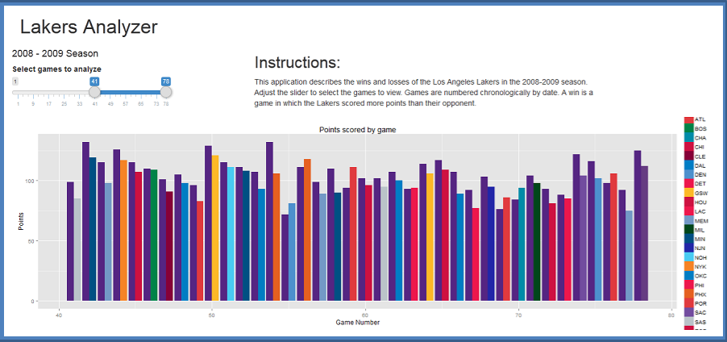

## Problem Background


```{r libraries, echo = FALSE, eval = TRUE}
library(lubridate)
data(lakers)
```

- The `lakers` dataset that comes with the lubridate R package contains all the 
play-by-play information of the Lakers 2008-2009 season.  
- The Lakers won the NBA Championship this season, so it would be useful to 
analyze this data to see what makes for an NBA champion.  
- The data contains 34,624 rows and is not useful in this state for 
analysis over a season.

```{r head lakers}
head(lakers, 3)
```

---  

## Context/Technical Background

- The app uses the dplyr package to get the dataset into a usable format.  
- The total points are calculated as a sum for each team per date.  
```{r scores sample, eval = TRUE, echo = FALSE}
suppressPackageStartupMessages(library(dplyr))
scores <- lakers %>% filter(team != 'OFF') %>% group_by(date, team) %>% 
  summarize(total = sum(points))
head(scores)
```
- A ggplot bargraph is output based on the user's selection of games, which
showcases the Lakers and their opponents points for that game.

--- 

## Solution

- The Lakers Analyzer app lets the user explore the Lakers 2008-2009 season on a 
game by game basis.
- The app allows the user to view the score of each Lakers game, looking for 
trends as the season progresses.



--- .class #id 

## Conclusions

- With a better understanding of how the Lakers performed over the season, an
analyst can drill into a particular trend to explore.
- For instance, we can see that the team started off the season with a 13 - 1
run. Now we can use further analysis techniques to see what the Lakers did in
those first 14 games and try to replicate that performance.

--- .class #id
